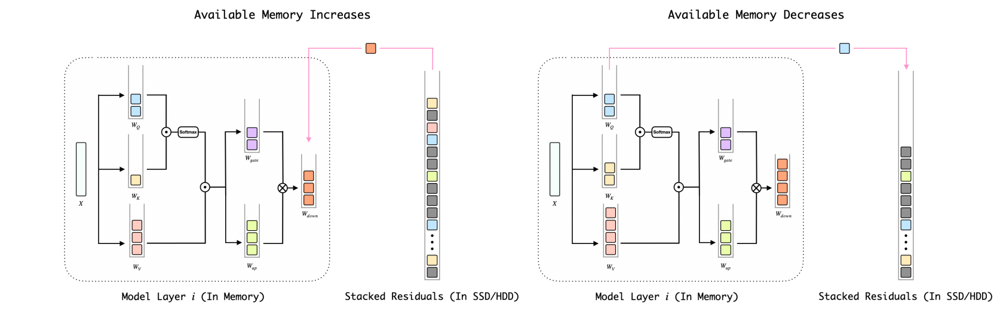

<p align="center">
  
</p>

<h1 align="center">BitStack: Fine-Grained Size Control for Compressed Large Language Models in Variable Memory Environments</h1>

<div align="center">
<a href="https://arxiv.org/abs/2410.23918" target="_blank"></a>
<a href="https://huggingface.co/BitStack" target="_blank"></a>
</div>



## ✨ TL;DR
BitStack breaks down large language models into tiny little blocks, which can be sorted and stacked universally, achieving megabyte-level memory-performance tradeoffs while maintaining or surpassing the performance of practical compression methods like GPTQ and AWQ. Check out [our paper](https://arxiv.org/abs/2410.23918) for more details!


## 📰 News
- [2024-11-01] Try out this [Colab demo](https://colab.research.google.com/drive/1GoXIVyhofOEpGzOUint8LOivlFSDVHle?usp=sharing) and play with BitStack models across various memory budgets using an intuitive slider built with Gradio!
- [2024-11-01] 📄 Check out our paper on [arXiv](https://arxiv.org/abs/2410.23918)!
- [2024-10-31] ✨ Pre-decomposed models are now available on [HuggingFace🤗](https://huggingface.co/BitStack)!
- [2024-10-31] 🚀 Code release! We have some awesome inference kernels for BitStack models coming soon, stay tuned!

## 🚀 Quick Start
### ⚙️ Installation
```
conda create -yn bitstack python=3.10
conda activate bitstack
pip install -e .
```

### 🔄 Decomposition
To run the decomposition of a model, run [this script](./scripts/decompose.sh) or the following command:
```
python -m bitstack.main \
    --model_name_or_path meta-llama/Meta-Llama-3.1-8B \
    --niter 16 \ # Number of iterations of decomposition, decrease for shorter runtime
    --k 16 \ # Number of singular vectors kept
    --nsamples 256 \ # Number of calibration samples
    --output_dir outputs \
    --do_save \
    --score_importance \ # Run the sorting process
    --generate_compression_configs # Generate compression configs
```

### 📊 Evaluation
To evaluate the decomposed model, run [this script](./scripts/evaluate.sh) or the following command:
```
python -m bitstack.main \
    --model_name_or_path /YOUR/CHECKPOINT/PATH \
    --k 16 \
    --max_memory_MB 5541 \ # Maximum available memory for the model
    --load_bitstack \ # Load the decomposed model
    --do_eval \ # Perplexity evaluation
    --lm_eval \ # Zero-shot evaluation
    --output_dir outputs
```
## 📌 Checkpoints
We provide pre-decomposed models and compression configs. Currently, the following models are available, with more to come—stay tuned!
| Model  | Download |
| :---: | :---: |
| Llama-3.1 | [🤗8B](https://huggingface.co/BitStack/BitStack-Llama-3.1-8B) / [🤗70B](https://huggingface.co/BitStack/BitStack-Llama-3.1-70B) |
| Llama-3 | [🤗8B](https://huggingface.co/BitStack/BitStack-Llama-3-8B) / [🤗70B](https://huggingface.co/BitStack/BitStack-Llama-3-70B) |
| Llama-2 | [🤗7B](https://huggingface.co/BitStack/BitStack-Llama-2-7B) / [🤗13B](https://huggingface.co/BitStack/BitStack-Llama-2-13B) / [🤗70B](https://huggingface.co/BitStack/BitStack-Llama-2-70B) |

You can download them via the following commands:
```
# (Optional) enable hf_transfer for faster download
# pip install hf_transfer
# export HF_HUB_ENABLE_HF_TRANSFER=1

huggingface-cli download BitStack/BitStack-Llama-3.1-8B --local-dir ./models/BitStack-Llama-3.1-8B
```
Or just download the compression config for your already decomposed model:
```
huggingface-cli download BitStack/BitStack-Llama-3.1-8B --local-dir /YOUR/CHECKPOINT/PATH/ --include "compression_config.json"
```

## 📖 Citation
```
@misc{wang2024bitstackfinegrainedsizecontrol,
      title={BitStack: Fine-Grained Size Control for Compressed Large Language Models in Variable Memory Environments}, 
      author={Xinghao Wang and Pengyu Wang and Bo Wang and Dong Zhang and Yunhua Zhou and Xipeng Qiu},
      year={2024},
      eprint={2410.23918},
      archivePrefix={arXiv},
      primaryClass={cs.CL},
      url={https://arxiv.org/abs/2410.23918}, 
}
```